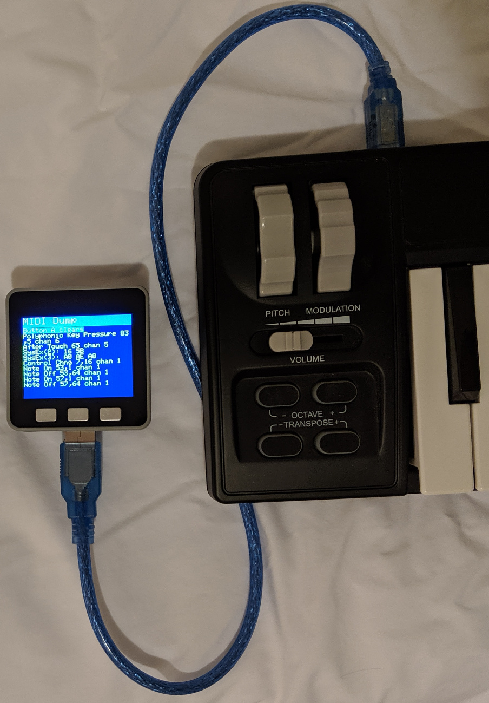

# M5Stack Portable USB Host MIDI Display

Plug in a USB MIDI keyboard into the M5Stack USB host port and see MIDI events
on the display. When the screen is full, press Button A to clear. Runs on
battery with a plain USB MIDI keyboard. USB MIDI devices with lots of LEDs or
complex functions such as sampler, sequencers, and displays may draw too much
current for the M5Stack battery. Try powering the M5Stack via its USB port or
power the MIDI device using its own power supply, if available.

## M5Stack Core + USB host module

The M5Stack USB module provides the USB host interface for the printer. The USB
module is based on the MAX3421E USB chip which is supported by the USB Host
Shield 2.0 library.

### Hardware

* M5Stack core (ESP32, battery, display, etc.) https://m5stack.com/collections/m5-core/products/grey-development-core
* M5Stack USB host module (MAX3421E) https://m5stack.com/collections/m5-module/products/usb-module
* USB MIDI keyboard
* USB cable

### Libraries

* USB Host Shield 2.0 https://github.com/felis/USB_Host_Shield_2.0
* Highly recommended: PR #473
* Highly recommended if using USB hubs: PR #414

## Arduino upload failure

I found installing a 1 uF capacitor between GND and RST helps a lot. See
the link for more discussion.

http://community.m5stack.com/topic/55/simple-fix-when-upload-fails

## Battery Power On Failure

When running on battery, the M5Stack does not turn on when the USB host module
is installed. The M5Stack works fine running on battery but once it is turned
off, it can only be turned on by plugging in power via the USB jack.

The M5Stack power on works correctly when the USB host module is removed.
